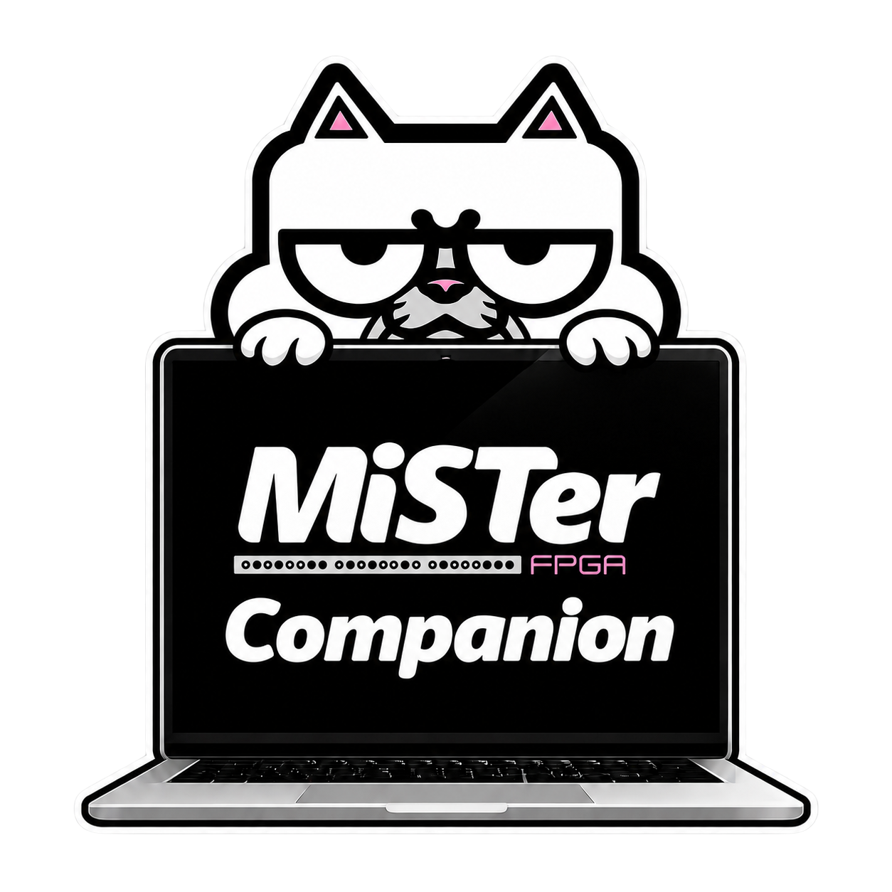

<div align="center">
  

  # MiSTer Companion
</div>

Cross-platform desktop companion for **MiSTer FPGA** (macOS / Windows / Linux).
Discover your MiSTer on the LAN, watch live status, launch games, reboot, run system
scripts over SSH, browse the SD card over SMB, and track RetroAchievements progress.

Built with Electron + TypeScript + React. Complements
[`python-mister-fpga`](https://github.com/hudsonbrendon/python-mister-fpga) and
[`ha-mister-fpga`](https://github.com/hudsonbrendon/ha-mister-fpga).

## Communication channels

- mrext Remote REST API (`:8182`) — status, launch, reboot
- mrext WebSocket — live core/game updates
- SSH (`ssh2`) — telemetry + script execution
- Discovery — subnet status-probe scan + mDNS
- SMB — browse `/media/fat` (the SD card)

## Installing the prebuilt apps

Download the installer for your OS from the
[latest release](https://github.com/hudsonbrendon/mister-companion/releases/latest).

These builds are **not code-signed** with a paid developer certificate yet, so the OS
warns on first launch:

**macOS** — if you see *"MiSTer Companion is damaged and can't be opened"*, clear the
download quarantine (adjust the path to where you moved the app):

```bash
xattr -cr "/Applications/MiSTer Companion.app"
```

Then open it normally. The build is ad-hoc signed, so after the `xattr` step it opens
without the "damaged" error.

**Windows** — SmartScreen shows *"Windows protected your PC"*. Click **More info →
Run anyway**.

## Develop

```bash
npm install
npm run dev      # run the app
npm run test     # Vitest
npm run package  # build installer for the current OS
```

## Supported platforms

macOS, Windows, Linux.

## License

MIT © Hudson Brendon
